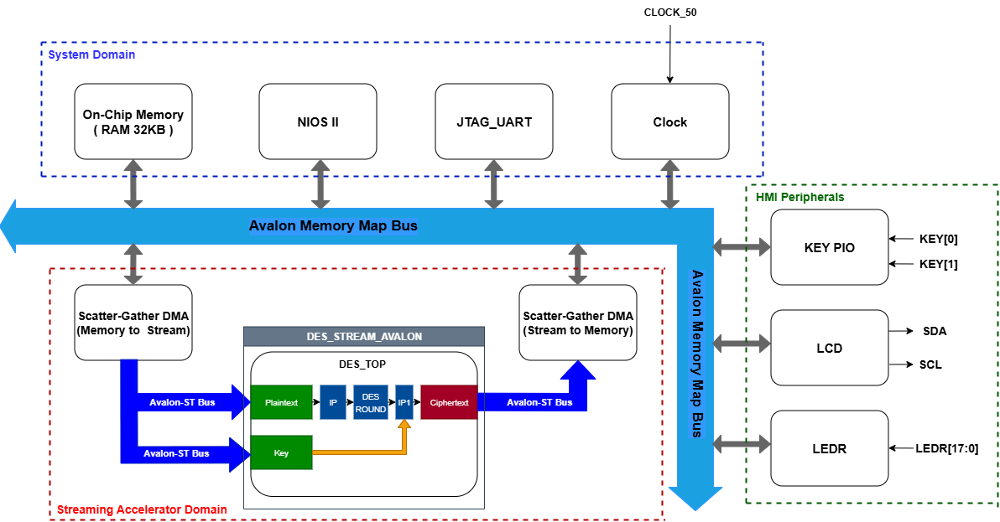
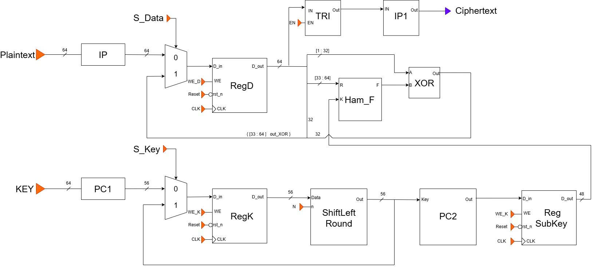
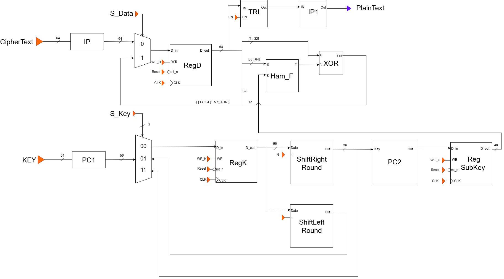
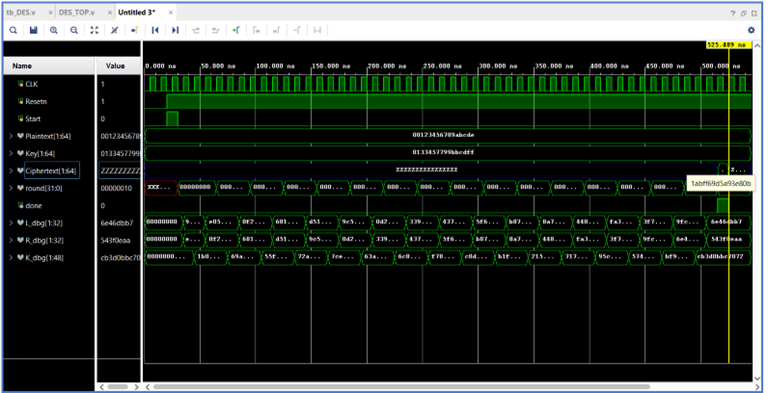
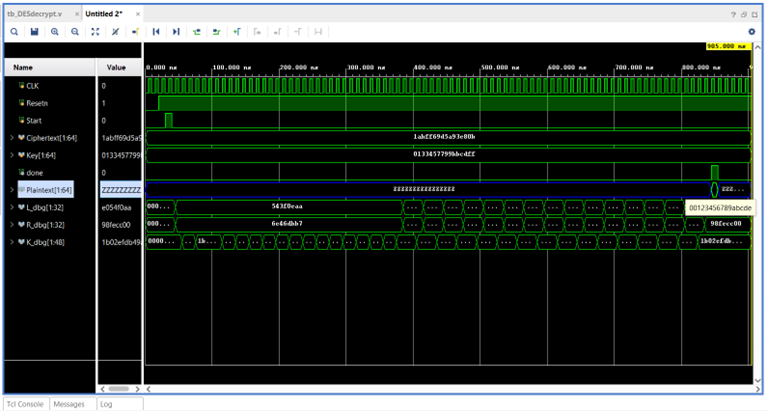
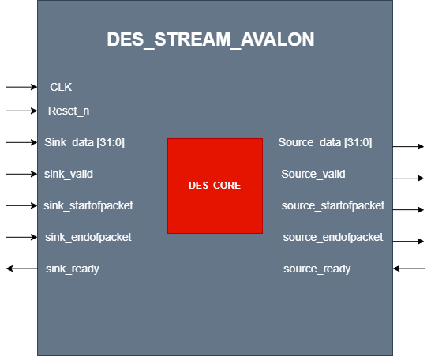
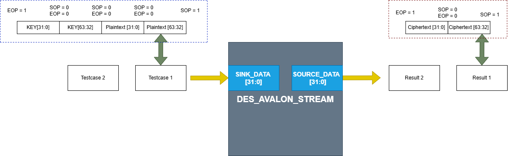

# DES64 Hardware Accelerator with SoC 

A hardware implementation of the DES (Data Encryption Standard) algorithm integrated into an FPGA-based SoC using Nios II and Scatter-Gather DMA for high-speed data transfer.

---

## Overview

This project implements a 64-bit DES hardware accelerator in Verilog HDL and integrates it into an Intel FPGA SoC.

The accelerator communicates with a Nios II processor through Avalon-MM interfaces, while Scatter-Gather DMA (SGDMA) is used to efficiently transfer plaintext, keys, and ciphertext between memory and the DES accelerator without continuous CPU intervention.

The project demonstrates the complete hardware/software co-design flow, including RTL design, FPGA integration, embedded software development, and hardware verification.

---
## Architecture

The system consists of:

- DES Hardware Accelerator
- Nios II Soft Processor
- Scatter-Gather DMA (SGDMA)
- Avalon-MM Interconnect
- On-chip Memory
- Embedded C Software Driver

---

## Schematic Datapath

#### Schematic Datapath Encrypt:

 

#### Schematic Datapath Decrypt:

---

## Simulation Result

Example standard DES test vector:

| Plaintext | Key | Ciphertext |
|---|---|---|
| 00123456789ABCDE | 0133457799BBCDFF | 1ABFF69D5A93E80B |
| 0123456789ABCDEF | 133457799BBCDFF1 | 85E813540F0AB405 |
| 1111111111111111 | 2222222222222222 | 08024FCF811DA672 |
| 0000000000000000 | 0000000000000000 | 8CA64DE9C1B123A7 |
| FFFFFFFFFFFFFFFF | FFFFFFFFFFFFFFFF | 7359B2163E4EDC58 |
| AAAAAAAAAAAAAAAA | 5555555555555555 | 343A09F9B2CB5CCA |
| 1234567890ABCDEF | 0F1571C947D9E859 | 180419FB1A3814AF |
| FEDCBA9876543210 | AABB09182736CCDD | CA246075E30CA7B7 |
| 13579BDF2468ACE0 | 1A2B3C4D5E6F7788 | 55ACF9E2DAA89BE9 |
| CAFEBABE12345678 | 0A0B0C0D0E0F1011 | 9782675A69186083 |

All Ciphertext after Decrypt is same as Plaintext => Correct
---

## Performance

- FSM-based sequential architecture
  
- Approximately 50 clock cycles per encryption
- **Synthesized Fmax:** ~227 MHz
  
- Approximately 80 clock cycles per encryption
- **Synthesized Fmax:** ~247 MHz
---
## Simulation Waveforms

#### Encrypt Waveform

 

#### Decrypt Waveform

---

## DES with Avalon Streamming
- The DES hardware core is wrapped with an Avalon-ST interface, enabling seamless streaming communication with Intel Platform Designer IPs. The wrapper supports packet-based data transfer using standard Avalon-ST handshake signals (`valid`, `ready`, `startofpacket`, `endofpacket`).

  

---

## Scatter-Gather DMA
- SGDMA streams plaintext and keys to the DES accelerator and writes the resulting ciphertext back to memory with minimal CPU involvement.

  

---
